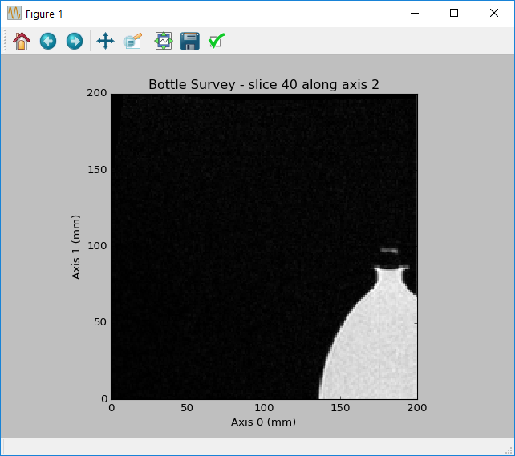

Examples
========

These examples demonstrate some of the basic use-cases of dicomtools.

Reading DICOM Data
------------------

You can either read a single DICOM file, multiple DICOM files from the same series, or a DICOMDIR file. A :class:`dicomtools.series.DicomSeries` object will be returned, except in the case of :meth:`dicomtools.dicom_read.read_dicomdir`, which will return a list of :class:`dicomtools.series.DicomSeries` objects.

Reading a DICOMDIR file:
::

	>>> import dicomtools
	>>> dicomtools.dicom_read.read_dicomdir('data/DICOMDIR')
	[<dicomtools.series.DicomSeries object at 0x00000000054A9EB8>,
	 <dicomtools.series.DicomSeries object at 0x0000000007EF3710>,
	 <dicomtools.series.DicomSeries object at 0x0000000007EF3DD8>]

Reading series of DICOM files:
::

	>>> import dicomtools
	>>> dicomtools.read_dicom_series(['data/im_001.dcm', 'data/im_002.dcm', 'data/im_003.dcm'])
	<dicomtools.series.DicomSeries object at 0x0000000008EF85C0>

Reading a single DICOM file:
::

	>>> import dicomtools
	>>> dicomtools.read_dicom('data/im_dat.dcm')
	<dicomtools.series.DicomSeries object at 0x0000000006718128>

Building a 3D Volume Dataset
----------------------------

If a :class:`dicomtools.series.DicomSeries` object represents 3D data, you can easily process this using the :class:`dicomtools.volume.DicomVolume`.

View a single slice of the 3D multi-frame dataset:
::

	>>> import dicomtools
	>>> series = dicomtools.read_dicom('data/im_dat.dcm')
	>>> volume = dicomtools.volume.DicomVolume(series)
	>>> dicomtools.visualization.plot_slice(volume, 2, 40)

Moving Between Image/Pixel and DICOM Patient Coordinates
--------------------------------------------------------

The :mod:`dicomtools.coordinates` module contains useful functions for transforming points between
coordinate systems, but with a :class:`dicomtools.volume.DicomVolume` object, it's much simpler.

Transform pixel ``(5,5)`` to the position in patient coordinates:
::

	>>> volume = dicomtools.volume.DicomVolume(series)
	>>> img2pat = volume.build_image_to_patient_matrix()
	>>> img2pat
	array([[   0.   ,    0.   ,   -1.2  ,   59.4  ],
	       [   1.136,    0.   ,    0.   , -180.   ],
	       [   0.   ,   -1.136,    0.   ,  180.   ],
	       [   0.   ,    0.   ,    0.   ,    1.   ]])
	>>> pixel_position = [5, 5]
	>>> dicomtools.coordinates.transform_vectors(img2pat, pixel_position)
	array([  59.4  , -174.318,  174.318])

Transform pixel ``(4,5,6)`` to the position in patient coordinates:
::

	>>> volume = dicomtools.volume.DicomVolume(series)
	>>> img2pat = volume.build_image_to_patient_matrix()
	>>> img2pat
	array([[   0.   ,    0.   ,   -1.2  ,   59.4  ],
	       [   1.136,    0.   ,    0.   , -180.   ],
	       [   0.   ,   -1.136,    0.   ,  180.   ],
	       [   0.   ,    0.   ,    0.   ,    1.   ]])
	>>> pixel_position = [4, 5, 6]
	>>> dicomtools.coordinates.transform_vectors(img2pat, pixel_position)
	array([  52.2  , -175.455,  174.318])

Transform a position in patient coordinates back to a pixel position:
::

	>>> import numpy as np
	>>> volume = dicomtools.volume.DicomVolume(series)
	>>> img2pat = volume.build_image_to_patient_matrix()
	>>> pat2img = np.linalg.inv(img2pat)
	>>> pat2img
	array([[   0.   ,    0.88 ,    0.   ,  158.4  ],
	       [  -0.   ,   -0.   ,   -0.88 ,  158.4  ],
	       [  -0.833,   -0.   ,   -0.   ,   49.5  ],
	       [   0.   ,    0.   ,    0.   ,    1.   ]])
	>>> dicomtools.coordinates.transform_vectors(pat2img, [59.4, -174.318, 174.318])
	array([ 5.,  5.,  0.])
	>>> dicomtools.coordinates.transform_vectors(pat2img, [52.2, -175.455, 174.318])
	array([ 4.,  5.,  6.])

Transform multiple positions simultaneously (faster than transforming each individually):
::

	>>> volume = dicomtools.volume.DicomVolume(series)
	>>> img2pat = volume.build_image_to_patient_matrix()
	>>> img2pat
	array([[   0.   ,    0.   ,   -1.2  ,   59.4  ],
	       [   1.136,    0.   ,    0.   , -180.   ],
	       [   0.   ,   -1.136,    0.   ,  180.   ],
	       [   0.   ,    0.   ,    0.   ,    1.   ]])
	>>> pixel_positions = [[4,5,6], [5,5,0]]
	>>> dicomtools.coordinates.transform_vectors(img2pat, pixel_positions)
	array([[  52.2  , -175.455,  174.318],
	       [  59.4  , -174.318,  174.318]])

Exporting DICOM Images to PNG
-----------------------------

The :mod:`dicomtools.export` module contains useful functions for exporting images.

Exporting a :class:`dicomtools.volume.DicomVolume` pixel data to multiple image files:
::

	>>> volume = dicomtools.volume.DicomVolume(series)
	>>> volume.export_images('images_dir', 'image')

Exporting a single image slice:
::

	>>> volume = dicomtools.volume.DicomVolume(series)
	>>> im_data = volume.info['pixel_data'][:,:,10]
	>>> dicomtools.export.export_image_to_png(im_data, 'images_dir/image.png')

